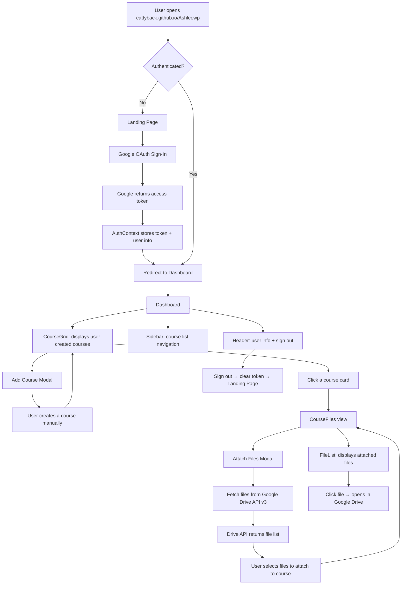

# Mermaid Diagram

```mermaid
flowchart TD
    A[User opens cattyback.github.io/Ashleewp] --> B{Authenticated?}
    B -- No --> C[Landing Page]
    C --> D[Google OAuth Sign-In]
    D --> E[Google returns access token]
    E --> F[AuthContext stores token + user info]
    F --> G[Redirect to Dashboard]
    B -- Yes --> G

    G --> H[Dashboard]
    H --> I[CourseGrid: displays user-created courses]
    H --> J[Sidebar: course list navigation]

    I --> K[Add Course Modal]
    K --> L[User creates a course manually]
    L --> I

    I --> M[Click a course card]
    M --> N[CourseFiles view]
    N --> O[Attach Files Modal]
    O --> P[Fetch files from Google Drive API v3]
    P --> Q[Drive API returns file list]
    Q --> R[User selects files to attach to course]
    R --> N

    N --> S[FileList: displays attached files]
    S --> T[Click file → opens in Google Drive]

    H --> U[Header: user info + sign out]
    U --> V[Sign out → clear token → Landing Page]
```
